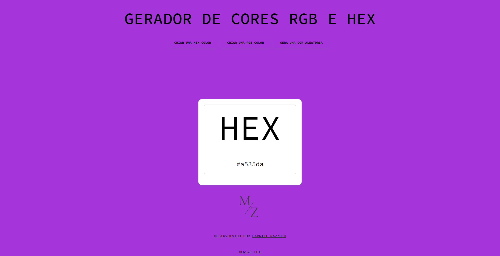
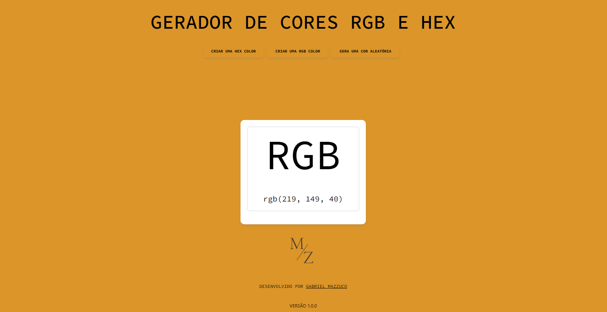

# <p align="center">Gerador de HEX e RGB usando React + Vite</p>
#### <p align="center">Projeto pessoal</p>
##### <p align="center">Desenvolvido por: [Gabriel Mazzuco](https://github.com/gabrielmazz)

---

# Introdução

Este projeto foi desenvolvido com o intuito de praticar e aprender mais sobre React e Vite. O projeto consiste em um gerador de cores HEX e RGB, onde o usuário pode escolher gerar uma cor aleatória apenas clicando em um botão.

<p align="center">
    
</p>

A ideia é que a cada clique no botão, uma nova cor é gerada, alterando o fundo da página e exibindo o código da cor em HEX e RGB.

<p align="center">
    
</p>

<p align="center">
    
</p>

# Tecnologias utilizadas

- HTML: Estruturação da página web
- CSS: Estilização da página web
- JavaScript: Lógica de programação

# Bibliotecas utilizadas

- [React](https://reactjs.org/): Biblioteca JavaScript para construção de interfaces de usuário
    - [React Spring](https://react-spring.io/): Biblioteca para animações em React
- [Tailwind CSS](https://tailwindcss.com/): Framework CSS para estilização da página web
- [Vite](https://vitejs.dev/): Build tool para projetos web

# Como rodar o projeto

Para rodar o projeto, siga os passos abaixo:

1. Clone o repositório
```bash
git clone
```

2. Instale as dependências
```bash
npm install
npm install tailwindcss
npm install @react-spring/web
```
3. Rode o projeto
```bash
npm run dev
```